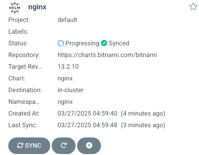
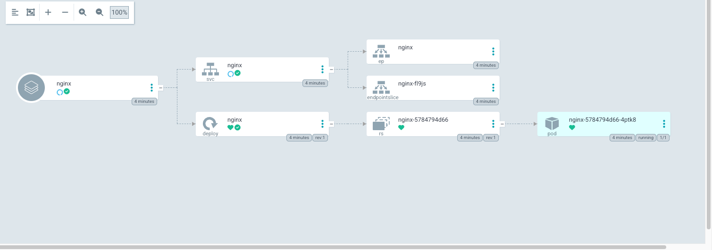
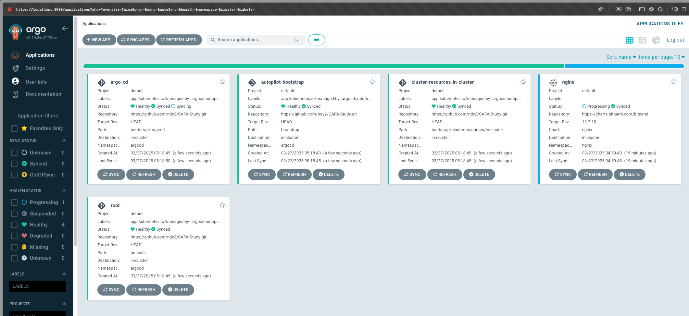
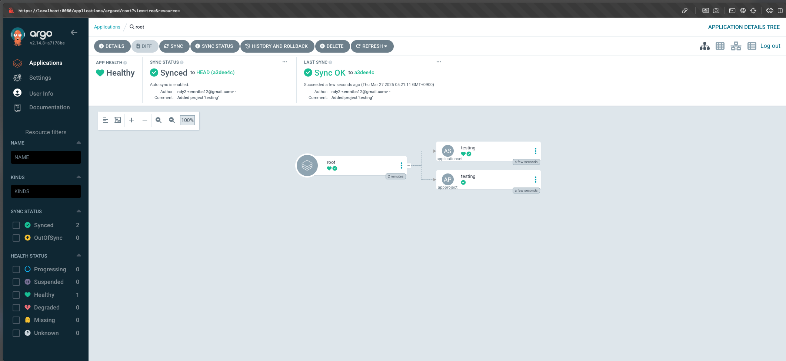
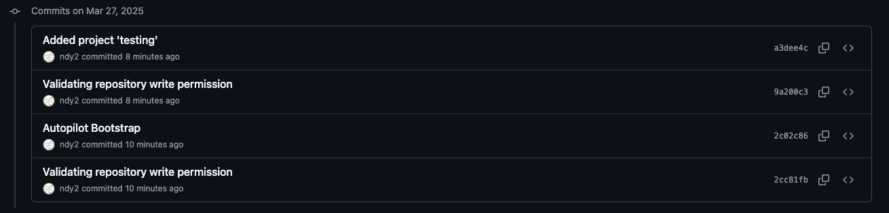

## ArgoCD 설치 (by helm)

```
╭─deukyun@namdeug-yun-ui-Macmini ~
╰─$ helm repo add argo https://argoproj.github.io/argo-helm
"argo" has been added to your repositories
```

```
╭─deukyun@namdeug-yun-ui-Macmini ~
╰─$ k create ns argocd
namespace/argocd created
```

```
╭─deukyun@namdeug-yun-ui-Macmini ~
╰─$ helm install ch02 -n argocd argo/argo-cd
NAME: ch02
LAST DEPLOYED: Wed Mar 26 18:54:52 2025
NAMESPACE: argocd
STATUS: deployed
REVISION: 1
TEST SUITE: None
NOTES:
In order to access the server UI you have the following options:

1. kubectl port-forward service/ch02-argocd-server -n argocd 8080:443

    and then open the browser on http://localhost:8080 and accept the certificate

2. enable ingress in the values file `server.ingress.enabled` and either
      - Add the annotation for ssl passthrough: https://argo-cd.readthedocs.io/en/stable/operator-manual/ingress/#option-1-ssl-passthrough
      - Set the `configs.params."server.insecure"` in the values file and terminate SSL at your ingress: https://argo-cd.readthedocs.io/en/stable/operator-manual/ingress/#option-2-multiple-ingress-objects-and-hosts


After reaching the UI the first time you can login with username: admin and the random password generated during the installation. You can find the password by running:

kubectl -n argocd get secret argocd-initial-admin-secret -o jsonpath="{.data.password}" | base64 -d

(You should delete the initial secret afterwards as suggested by the Getting Started Guide: https://argo-cd.readthedocs.io/en/stable/getting_started/#4-login-using-the-cli)
```

## Application 생성 및 UI 확인

```yaml
apiVersion: argoproj.io/v1alpha1  # Argo CD의 CRD(Application) 사용
kind: Application                 # Argo CD에서 관리하는 애플리케이션 정의
metadata:
  name: nginx                     # 애플리케이션 이름
  namespace: argocd               # Argo CD가 설치된 네임스페이스
  finalizers:
    - resources-finalizer.argocd.argoproj.io  # 애플리케이션 삭제 시 Argo CD가 리소스를 정리하도록 설정

spec:
  syncPolicy:
    automated:
      prune: true                  # Git에서 리소스가 삭제되면 클러스터에서도 삭제
      selfHeal: true                # 클러스터와 Git 상태가 다를 경우 자동으로 동기화
    syncOptions:
      - CreateNamespace=true        # 네임스페이스가 존재하지 않으면 자동 생성

  destination:
    namespace: nginx                # 배포할 네임스페이스 (없으면 자동 생성됨)
    server: https://kubernetes.default.svc  # Kubernetes API 서버 주소 (내부 클러스터)

  project: default                  # Argo CD의 프로젝트 설정 (기본값 사용)

  source:
    repoURL: https://charts.bitnami.com/bitnami  # Helm 차트 저장소 URL
    chart: nginx                     # 사용할 Helm 차트 이름
    targetRevision: 13.2.10           # 사용할 차트 버전
```


```
╭─deukyun@namdeug-yun-ui-Macmini ~
╰─$ k port-forward svc/ch02-argocd-server -n argocd 8080:443                                                                                       130 ↵
Forwarding from 127.0.0.1:8080 -> 8080
Forwarding from [::1]:8080 -> 8080
```

```
╭─deukyun@namdeug-yun-ui-Macmini ~
╰─$ kubectl -n argocd get secret argocd-initial-admin-secret -o jsonpath="{.data.password}" | base64 -d

tKAeT5ZivIFOwGWV%
```





## ArgoCD Autopilot

ref - https://argocd-autopilot.readthedocs.io/en/stable/

Argo CD Autopilot 은 Argo CD를 자동으로 설정하고 GitOps 방식으로 관리할 수 있도록 도와주는 도구임.

```
╭─deukyun@namdeug-yun-ui-Macmini ~/Desktop/CAPA-Study/books/ch02 ‹main●›
╰─$ argocd-autopilot repo bootstrap --git-token=$GIT_TOKEN --repo=https://github.com/ndy2/CAPA-Study                   1 ↵
INFO cloning repo: https://github.com/ndy2/CAPA-Study.git
Enumerating objects: 27, done.
Counting objects: 100% (27/27), done.
Compressing objects: 100% (22/22), done.
Total 27 (delta 0), reused 19 (delta 0), pack-reused 0 (from 0)
INFO using revision: "", installation path: ""
INFO using context: "kind-kind", namespace: "argocd"
INFO applying bootstrap manifests to cluster...
Warning: resource namespaces/argocd is missing the kubectl.kubernetes.io/last-applied-configuration annotation which is required by apply apply. apply apply should only be used on resources created declaratively by either apply create --save-config or apply apply. The missing annotation will be patched automatically.
namespace/argocd configured
...
```



```
╭─deukyun@namdeug-yun-ui-Macmini ~/Desktop/CAPA-Study/books/ch02 ‹main●›
╰─$ argocd-autopilot project create testing --git-token=$GIT_TOKEN --repo=https://github.com/ndy2/CAPA-Study
INFO cloning git repository: https://github.com/ndy2/CAPA-Study.git
Enumerating objects: 42, done.
Counting objects: 100% (42/42), done.
Compressing objects: 100% (33/33), done.
Total 42 (delta 1), reused 35 (delta 1), pack-reused 0 (from 0)
INFO using revision: "", installation path: "/"
INFO pushing new project manifest to repo
INFO project created: 'testing'
```


```
╭─deukyun@namdeug-yun-ui-Macmini ~/Desktop/CAPA-Study/books/ch02 ‹main●›
╰─$ k get applications -A
NAMESPACE   NAME                           SYNC STATUS   HEALTH STATUS
argocd      argo-cd                        Synced        Healthy
argocd      autopilot-bootstrap            Synced        Healthy
argocd      cluster-resources-in-cluster   Synced        Healthy
argocd      nginx                          Synced        Progressing
argocd      root                           Synced        Healthy
```

```
╭─deukyun@namdeug-yun-ui-Macmini ~/Desktop/CAPA-Study/books/ch02 ‹main●›
╰─$ k get appprojects -A
NAMESPACE   NAME      AGE
argocd      default   10h
argocd      testing   6m33s
```


