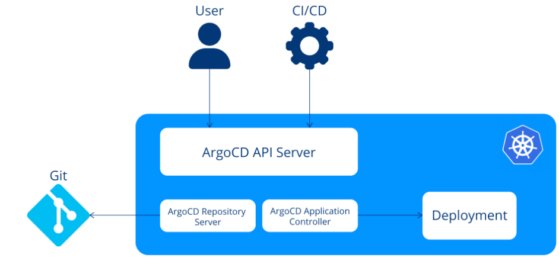

# Argo CD

## Key Advancements

- GitOps
- Continuous Delivery
- Rollback
- Multi-env management
- UI and API

## 주요 용어

- Configuration
  - Application - manifests 로 정의된 k8s 리소스 모음, argo 에서는 crd 로 표현된다.
  - Application source type - e.g.) Helm or Kustomize
- States
  - Target state - 애플리케이션에게 기대하는 상태, Git repository 에 표현됨, source of truth
  - Live state - 현재 state
- Statuses
  - Sync status - live state 와 target state 가 맞는지 보여주는 status
  - Sync operation status - sync 중의 status (failed or succeeded)
  - Health status
- Actions
  - Refresh - 상태 비교 (Git Repository <-> Live state)
  - Sync - 실제 k8s cluster 에 target state 로의 변경을 적용하는 과정

## Core Components

- Controllers
- API Server
- Repository Server
- Application Controller

## Argo CD Reconciliation Loop

TODO

## Argo CD Synchronization Principles

TODO
