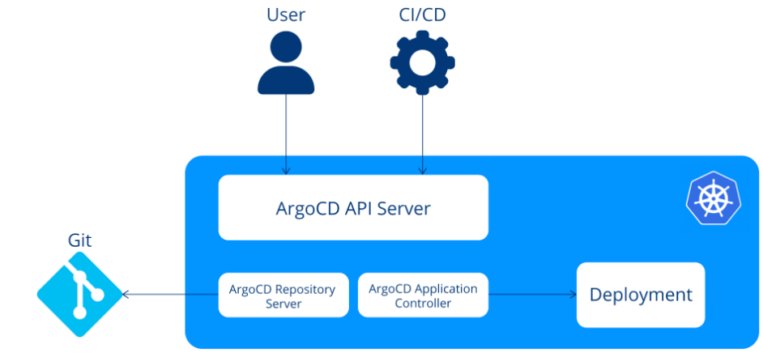

# Argo CD

ref - https://argo-cd.readthedocs.io/en/latest/

## Key Advancements

- GitOps
- Continuous Delivery
- Rollback
- Multi-env management
- UI and API

## 주요 용어

- Configuration
  - Application - manifests 로 정의된 k8s 리소스 모음, argo 에서는 crd 로 표현된다.
  - Application source type - e.g.) Helm or Kustomize
- States
  - Target state - 애플리케이션에게 기대하는 상태, Git repository 에 표현됨, source of truth
  - Live state - 현재 state
- Statuses
  - Sync status - live state 와 target state 가 맞는지 보여주는 status
  - Sync operation status - sync 중의 status (failed or succeeded)
  - Health status
- Actions
  - Refresh - 상태 비교 (Git Repository <-> Live state)
  - Sync - 실제 k8s cluster 에 target state 로의 변경을 적용하는 과정

## Core Components

- Controllers
- [API Server](https://argo-cd.readthedocs.io/en/stable/operator-manual/architecture/#api-server)
- [Repository Server](https://argo-cd.readthedocs.io/en/stable/operator-manual/architecture/#repository-server)
  - responsible for generating and returning the Kubernetes manifests
- [Application Controller](https://argo-cd.readthedocs.io/en/stable/operator-manual/architecture/#application-controller)



## Argo CD Reconciliation Loop

Argo CD 에서 Reconciliation (재조정) 은 선언형 방식으로 관리되는 Application 이 항상 원하는 상태 (Desired State) 를 유지하도록 하는 핵심 개념

Reconciliation Loop : Observe -> Compare -> Reconcile & Sync

**주요 특징**

- Drift Detection
- GitOps 원칙 준수 - Single source of Truth

## Argo CD Synchronization Principles

동기화 (Sync) 과정은 매우 중요하고 `Resource Hooks` 와 `Sync Waves` 를 통해 Customize 될 수 있다.

### [`Resource Hooks`](https://argo-cd.readthedocs.io/en/stable/user-guide/resource_hooks/)

**Sync** 는 실제 k8s cluster 에 target state 로의 변경을 적용하는 과정이다.
`Resource Hooks` 을 적용할 수 있는 구간이 5 개 있다.

- PreSync
- Sync
- PostSync
- Skip
- SyncFail

Resource hook 은 k8s job 으로 작성되며 간단하게 annotation 을 추가 하는 방식으로 동작한다.

```yaml
apiVersion: batch/v1
kind: Job
metadata:
  generateName: schema-migrate-
  annotations:
    argocd.argoproj.io/hook: PreSync
```

### Sync waves

Argo CD의 Sync Wave 는 여러 리소스를 배포할 때 의존성 순서를 지정하는 기능임.
즉, Kubernetes 리소스 간의 배포 순서를 제어할 수 있도록 함.

```yaml
metadata:
  annotations:
    argocd.argoproj.io/sync-wave: "5"
```

## Objects & Resources

### Simplifying Application Management

Argo CD 는 CRD 를 통해 k8s 환경의 애플리케이션의 관리를 돕습니다

### Application

### AppProject

- grouping of applications

### Repository Credentials

### Cluster Credentials

## Argo CD Extensions & Integration

### Plugins

- Argo CD 는 k8s configmap 을 활용해 plugin 을 설정합니다.
- notification plugin example

```yaml
apiVersion: v1
kind: ConfigMap
metadata:
  name: argocd-notifications-cm
data:
  context: |
    region: east
    environmentName: staging

  template.a-slack-template-with-context: |
    message: "Something happened in {{ .context.environmentName }} in the {{ .context.region }} data center!"
```

- image updater plugin
- argocd autopilot
- argocd interlace
- ...


