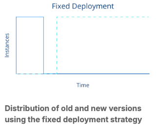
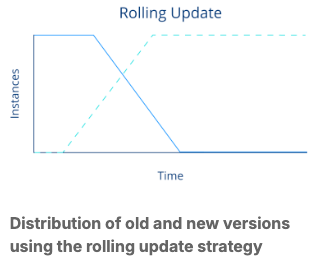
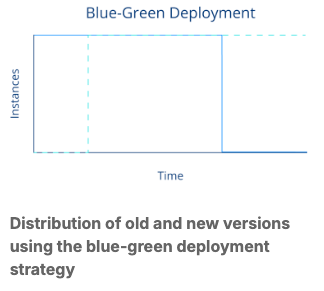
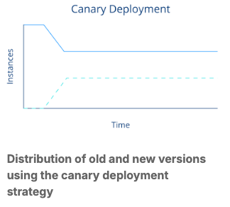
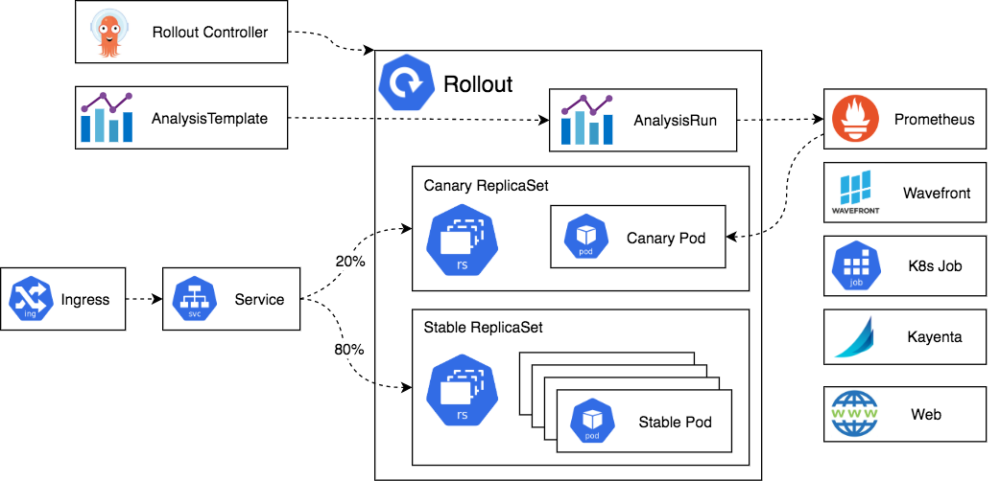

# Argo Rollouts

ref - https://argo-rollouts.readthedocs.io/en/latest/

## Essentials of CI/CD and Progressive Delivery

### Continuous Integration

CI 는 코드를 공유된 repository 에 하루에 몇번이라도! 자주! 반영하는 개발 방법을 의미한다. 매 반영(integration) 은 자동화된 빌드와 테스트에 의해 검증된다.

**CI 의 특징** 

- Frequent code commits
- Automated tests
- Immediate problem detection
- Reduced integration problems

CI 의 목표는 code base 의 결함에 대한 빠른 피드백을 얻는 것이다.
코드가 메인 브랜치에 들어갔다고 해서 곧바로 프로덕션에 배포되거나 릴리스되는 것은 아니다. 바로 여기서 Continuous Delivery(지속적 배포) 개념이 등장한다.

### Continuous Delivery

CD 는 CI 의 확장이다. 전체 software 의 자동화된 release 절차를 수반한다.

**CD 의 특징**

- Automated release process
- Reliable deployments
- Rapid release cycles
- Close collaboration between teams

지속적 배포(Continuous Delivery)의 목표는 소프트웨어 배포가 예측 가능하고 일상적인 프로세스로 만들어지며, 필요할 때 언제든지 실행할 수 있도록 하는 것이다.

### Progressive Delivery

Progressive delivery 는 종종 CD 의 진화라고 여겨진다. Product 의 업데이트를 더욱더 controlled 하고 gradual 한 방식으로 릴리즈 하는것에 집중한다. 이는 릴리즈의 위험성을 줄인다. 특히, metric 분석을 자동화 하여, 자동화된 promotion/ rollback 을 수행하는 방식을 활용한다.

**PD 의 특징**
- Canary releases
- Feature flags
- Experiments & A/B testing
- Phased rollouts

### 배포 전략

#### Recreated/fixed deployment

~ k8s deployment - `strategy.type: Recreate`

#### Rolling update

~ k8s deployment - `strategy.type: RollingUpdate` - default

#### Blue-green deployment

~ Argo Rollouts

#### Canary deployment

~ Argo Rollouts	

## Argo Rollouts Architecture and Core Components

- Argo Rollouts Controller
- Argo Rollout Resource
- Ingress
- Service
- ReplicaSet
- AnalysisTemplate and AnalysisRun (optional)
- Metric Providers (optional)

## A Refresher: k8s replica set

k8s Deployment 는 ReplicaSet 을 한층 더 추상화 하여 Recreated-Fixed/ Rolling Update 등의 배포 전략을 가능하게 하지만 아직 부족하다!
Let's talk about Argo Rollouts

## Argo Rollouts

[**Rollout**](https://argoproj.github.io/argo-rollouts/features/specification/) - k8s deployment 와 유사하지만, progressive delivery 에 필요한 더 확장된 기능을 제공한다.

기능 들

- Blue-green deployments
- Canary deployments
- Advanced traffic routing
- Integration with metric providers
- Automated decision-making

