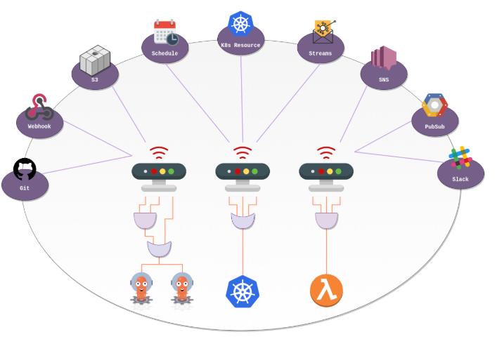

# Argo Events

ref - https://argoproj.github.io/argo-events/

Argo Events 는 k8s 에서의 Event-Driven Architecture 를 지원합니다.

## Event-Driven Architecture

전통적인 linear, request-response 한 방식의 architectures 와 달리, EDA 는 더욱 dynamic, fluid 한 방식이다.  

k8s 의 core 에는 event 가 있다. 이는 파드의 생명 주기 변화나 서비스 업데이트와 같은 시스템 내에서 발생하는 다양한 동작이나 변화를 의미한다. Kubernetes 에서의 EDA 는 이러한 이벤트에 자동화되고 확장 가능하도록 대응하는 방식이다. 이러한 운영 방식은 Kubernetes 클러스터 내에서 끊임없이 변화하는 상태를 더욱 효율적으로 처리할 수 있도록 해준다.

NOTE: k8s 자체가 event 를 기반의 아키텍쳐를 가진다!

Argo Events 는 Kubernetes 를 위한 도구로 등장하여 이벤트 중심 패러다임을 구현하는 데 도움을 준다. 이는 단순한 추가 기능이 아니라, Kubernetes 의 기능을 확장하는 통합 솔루션이다.

Argo Events 의 핵심 구성요소:

- Event Source
- Sensor
- EventBus
- Trigger

