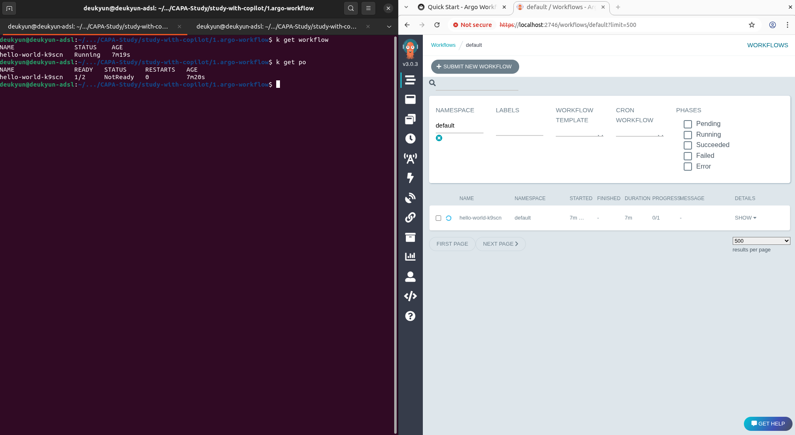
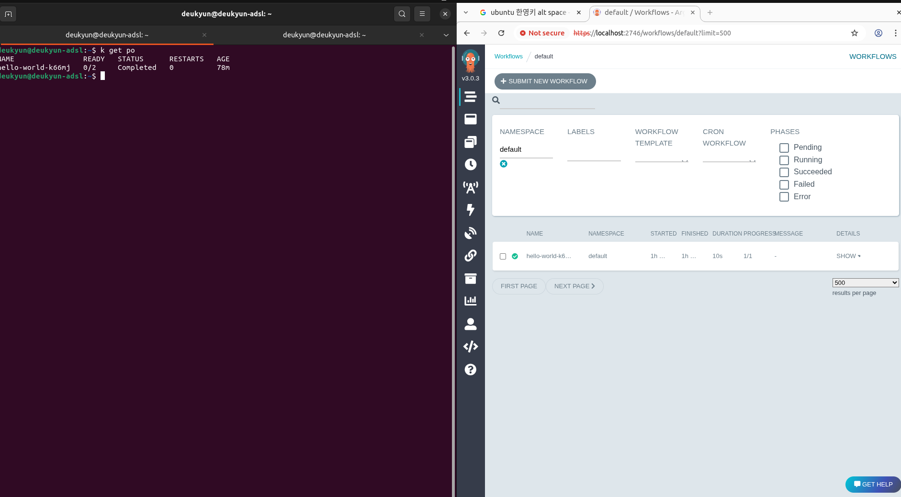

## 1. **Introduction**

1. What is Argo Workflow?
Argo Workflow는 Kubernetes 위에서 실행되는 워크플로우 엔진입니다.
복잡한 작업을 **워크플로우(Workflow)**로 정의하고, 이를 컨테이너 기반으로 실행할 수 있도록 설계되었습니다.
주로 데이터 처리 파이프라인, CI/CD 파이프라인, 또는 머신러닝 워크플로우를 자동화하는 데 사용됩니다.

2. Key Features and Benefits
Kubernetes 네이티브: Kubernetes 클러스터에서 직접 실행되며, 클라우드 네이티브 환경에 최적화되어 있습니다.
유연한 워크플로우 정의: DAG(Directed Acyclic Graph) 또는 단계 기반(steps-based) 워크플로우를 지원합니다.
확장성: 대규모 작업을 처리할 수 있도록 설계되었습니다.
오픈소스: 누구나 사용하고 확장할 수 있는 오픈소스 프로젝트입니다.

---

Q. 실습해보고 싶어

좋아요! Argo Workflow를 실습하려면 Kubernetes 클러스터와 Argo Workflow가 설치되어 있어야 합니다. 아래는 간단한 실습을 시작하기 위한 단계입니다.

---

### 1. **Argo Workflow 설치**
먼저, Argo Workflow를 설치해야 합니다. Kubernetes 클러스터가 준비되어 있다고 가정하고 진행하겠습니다.

```bash
kubectl create namespace argo
kubectl apply -n argo -f https://raw.githubusercontent.com/argoproj/argo-workflows/stable/manifests/install.yaml
```

이 명령어는 Argo Workflow의 모든 리소스를 `argo` 네임스페이스에 설치합니다.

---

### 2. **간단한 워크플로우 실행**
설치가 완료되면, 간단한 워크플로우를 실행해볼 수 있습니다. 아래는 기본적인 워크플로우 YAML입니다.

```yaml
apiVersion: argoproj.io/v1alpha1
kind: Workflow
metadata:
  generateName: hello-world-
spec:
  entrypoint: whalesay
  templates:
  - name: whalesay
    container:
      image: docker/whalesay:latest
      command: [cowsay]
      args: ["Hello, Argo!"]
```

이 파일을 `hello-world.yaml`로 저장한 뒤, 다음 명령어로 실행하세요:

```bash
kubectl apply -f hello-world.yaml
```

---

### 3. **워크플로우 상태 확인**
워크플로우가 실행 중인지 확인하려면 다음 명령어를 사용하세요:

```bash
kubectl get workflows
```

워크플로우의 상세 상태를 보려면:

```bash
kubectl describe workflow <워크플로우 이름>
```

---

### 4. **Argo UI 사용**
Argo Workflow는 웹 UI도 제공합니다. UI를 실행하려면 포트 포워딩을 설정하세요:

```bash
kubectl -n argo port-forward svc/argo-server 2746:2746
```

그런 다음 브라우저에서 `https://localhost:2746`로 접속하면 됩니다.

---

이 실습을 진행하면서 궁금한 점이 있거나, 특정 부분을 더 자세히 알고 싶다면 알려주세요! 😊


---

실행 결과



---

Q:

ㅇㅋ 잘 실행 되었어. 그런데

deukyun@deukyun-adsl:<del>/.../CAPA-Study/study-with-copilot/1.argo-workflow$ k get workflow
NAME STATUS AGE
hello-world-k9scn Running 7m19s
deukyun@deukyun-adsl:</del>/.../CAPA-Study/study-with-copilot/1.argo-workflow$ k get po
NAME READY STATUS RESTARTS AGE
hello-world-k9scn 1/2 NotReady 0 7m20s

이런식으로 파드가 컨테이너 두개 짜리가 떴거든? 근데 보니까 하나는 wait 이고 하나는 main 이던데 이걸 설명할 수 있니?

-> 

....

containerRuntimeExecutor: pns 로 configmap 설정을 바꾸니 해결 됨

